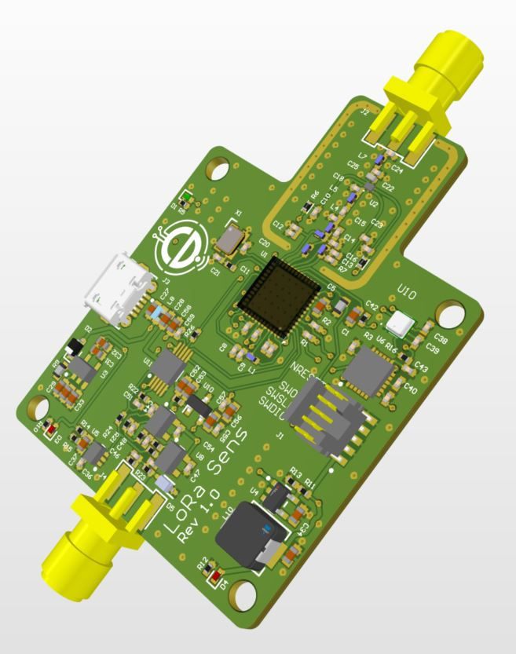
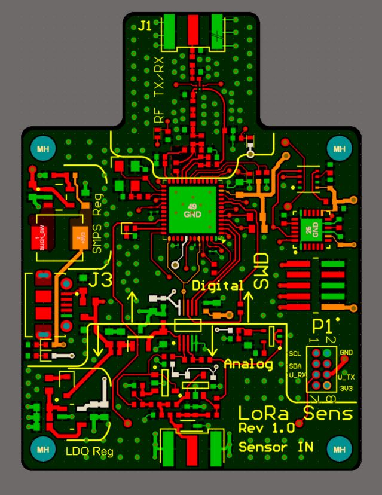

# STM32WL LoRa Sensor Board

**Mixed-Signal | Sub-GHz RF / LoRa | Analogue Front End | STM32WL | Altium Designer | LTspice | Python**



## Project Overview

I designed this STM32WL-based wireless sensor board as a mixed-signal and RF hardware development project combining analogue signal acquisition, embedded processing and long-range sub-GHz wireless communication.

The design is centred on the **STM32WL**, which combines an STM32 microcontroller with an integrated sub-GHz radio. I developed the surrounding analogue front end, filtering, power architecture, RF interface and PCB layout, with particular attention to keeping the analogue, digital and RF sections well controlled on the same board.

I also used **LTspice and Python analysis** to investigate the analogue signal path and filter behaviour rather than relying solely on schematic calculations.

The project was developed using a staged **EVT → DVT → PVT** development approach. The repository documents the completed design and analysis work and the planned route through fabrication, bring-up, validation and production.

---

## Design Highlights

* STM32WL-based embedded and sub-GHz RF architecture
* LoRa / sub-GHz wireless interface
* Mixed-signal analogue and digital PCB design
* External analogue sensor input
* Analogue signal conditioning and anti-alias filtering
* Sallen-Key filter analysis
* Separate consideration of analogue, digital and RF power requirements
* RF matching/filter network
* 4-layer PCB layout
* LTspice circuit simulation
* Python/Jupyter signal analysis
* FFT, SNR and time-domain analysis
* Structured EVT / DVT / PVT development planning
* Design documentation covering schematic, PCB and engineering decisions

---

## System Architecture

The board combines four main engineering areas:

**Analogue Front End → STM32WL MCU/ADC → Digital Processing → Sub-GHz RF / LoRa**

The analogue section conditions the external sensor signal before conversion by the MCU ADC. The STM32WL provides the embedded processing and integrated sub-GHz radio, while the RF section provides the external matching/filtering and antenna interface.

The power architecture supports the mixed-signal nature of the design, with the PCB partitioned to reduce unwanted interaction between the analogue, digital and RF sections.

### Block Diagram

The complete system architecture is available here:

[View the system block diagram](Hardware/STM32WL_BlockDiagram.pdf)

---

## Analogue Front End

A significant part of this project was the analogue acquisition path.

I designed the signal-conditioning circuitry to accept an external sensor signal and prepare it for conversion by the STM32WL ADC.

The analogue design includes filtering intended to limit unwanted high-frequency content before ADC conversion and to provide a controlled signal path into the MCU.

Rather than treating the filter as an isolated schematic block, I analysed its behaviour using both circuit simulation and numerical analysis.

This included:

* Frequency-response analysis
* Sallen-Key filter behaviour
* Time-domain sine response
* Pulse/step response
* FFT analysis
* Signal-to-noise analysis

---

## LTspice Simulation

I used **LTspice** during development to investigate the analogue circuitry and verify expected behaviour before PCB implementation.

The simulation work includes:

* Bias generation / AC analysis
* Pseudo-differential analogue behaviour
* ADC input behaviour
* Sallen-Key frequency response
* Transient analysis
* Pulse response
* Time-domain signal behaviour

The LTspice material and associated results are available in:

[LTspice simulation files and results](Simulation/LTspice)

---

## Python Signal Analysis

I also used Python/Jupyter notebooks to provide an independent way of examining the analogue signal path and filter performance.

The analysis includes:

* FFT analysis
* Signal-to-noise analysis
* Sallen-Key filter analysis
* Time-domain sine-wave analysis
* Step and pulse response

The notebooks are available here:

[Python analysis](Simulation/Python_Analysis)

The corresponding plots are available here:

[Python analysis results](Simulation/Python_Analysis/Results)

This gave me a useful way of comparing calculated, simulated and numerical behaviour during the design.

---

## STM32WL and RF

The STM32WL was selected because it combines the MCU and sub-GHz radio functionality in a single device, making it well suited to a compact wireless sensor architecture.

The RF section includes the external components required between the STM32WL RF interface and antenna connection.

During the PCB design I treated the RF section as a distinct functional area and considered:

* RF component placement
* Short RF signal paths
* Grounding
* Matching/filter components
* Separation from noisy digital circuitry
* Interaction between RF, analogue and power sections

The objective was to integrate the RF section into the mixed-signal PCB without compromising the analogue acquisition path.

---

## PCB Design



I developed the PCB as a **4-layer mixed-signal design** in Altium Designer.

The layout was partitioned into identifiable functional areas including:

* RF
* Digital / STM32WL
* Analogue front end
* Sensor interface
* Power regulation

Particular attention was given to component placement, return-current paths, grounding and keeping sensitive analogue circuitry away from potential digital and RF noise sources.

A 3D representation of the resulting board is shown at the top of this README.

A more detailed schematic and PCB overview is available in the project documentation.

---

## Schematic

The complete schematic has been combined into a single PDF for quick review:

[View the complete schematic](Hardware/STM32WL_Schematic.pdf)

---

## Design Report

I produced a more detailed engineering report documenting the architecture, design decisions and analysis behind the project.

[View the full design report](Report/STM32WL_Design_Report.pdf)

The report is intended to provide the engineering detail behind the shorter portfolio overview presented here.

---

## Development Process

I structured the project around the common:

**EVT → DVT → PVT**

development model.

### EVT — Engineering Validation Test

The EVT plan covered:

* Research and simulation
* Schematic development
* PCB layout
* Layout revision
* Gerber release
* Prototype fabrication and assembly
* Initial power, MCU and analogue-front-end bring-up

### DVT — Design Validation Test

The planned DVT stage included:

* Design refinement following EVT
* Rev B design freeze
* DVT build
* EMC pre-scan
* Test fixture development

### PVT — Production Validation Test

The planned PVT stage included:

* Pilot build
* Formal CE/FCC/ETSI compliance activity
* Factory fixture validation
* Production-release preparation

The project plan is available here:

[View the EVT / DVT / PVT project plan](Project_Management/STM32WL_Project_Plan.pdf)

---

## Project Status

This repository is a **hardware design and engineering-analysis portfolio project**.

The documented work covers the architecture, simulation, schematic development, PCB layout and supporting engineering analysis.

The repository does **not** claim that the board has completed physical fabrication, hardware bring-up, DVT/PVT or formal regulatory certification.

Those activities are shown in the project plan as subsequent development stages rather than completed validation.

This distinction is intentional: the repository documents the engineering work I completed without presenting planned validation activity as completed product qualification.

---

## Repository Structure

```text

STM32WL-LoRa-Sensor-Board-Portfolio
│
├── Hardware
│   ├── STM32WL_BlockDiagram.pdf
│   └── STM32WL_Schematic.pdf
│
├── Images
│   ├── STM32WL_PCB_3D.jpg
│   └── STM32WL_PCB_Layout.jpg
│
├── Project_Management
│   ├── STM32WL_Project_Plan.pdf
│   └── STM32WL_Project_Plan.xlsx
│
├── Report
│   └── STM32WL_Design_Report.pdf
│
├── Simulation
│   ├── LTspice
│   │
│   └── Python_Analysis
│       ├── results images
│       ├── Python_FFT.ipynb
│       ├── Python_SNR.ipynb
│       ├── SallenKey_Analysis.ipynb
│       ├── README.md
│       └── README_FilterSim.md
│
├── .gitattributes
├── LICENSE
└── README.md
```

---

## Tools Used

**Hardware Design**

* Altium Designer
* LTspice

**Embedded / RF**

* STM32WL
* Sub-GHz / LoRa architecture

**Analysis**

* Python
* Jupyter Notebook
* FFT analysis
* SNR analysis
* Time-domain analysis

**Development**

* Git / GitHub
* EVT / DVT / PVT project planning

---

## What This Project Demonstrates

For me, this project brings together several areas of electronics design that are often treated separately:

**analogue electronics + embedded hardware + RF + PCB design + simulation + engineering verification**

It demonstrates how I approach a mixed-signal design from system architecture through schematic and PCB implementation, while using simulation and numerical analysis to support the design decisions.

The emphasis is not just on producing a schematic or PCB, but on understanding how the analogue, digital, RF and power sections interact as a complete electronic system.
