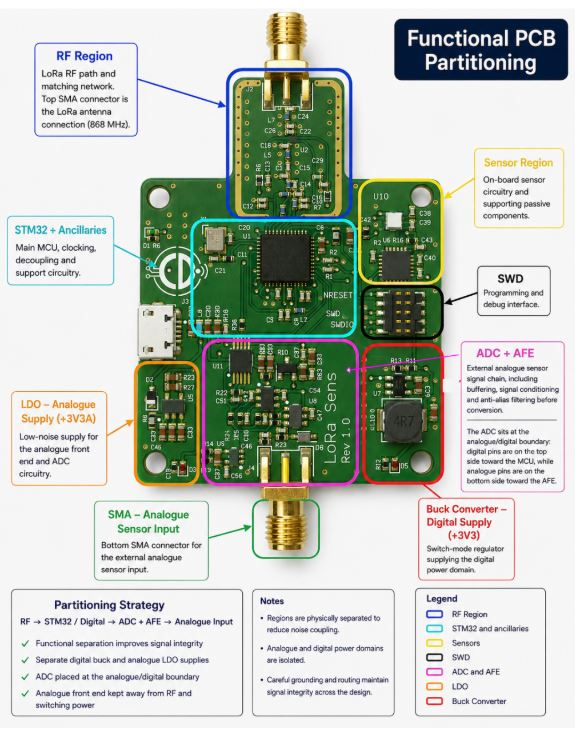

# STM32WL LoRa Sensor Board

**Mixed-Signal | Sub-GHz RF / LoRa | Analogue Front End | STM32WL | Altium Designer | LTspice | Python**


## Project Overview

I designed this STM32WL-based wireless sensor board as a mixed-signal hardware project combining analogue signal acquisition, embedded processing and sub-GHz LoRa communications. The design includes the analogue front end, ADC filtering, power architecture, RF interface and 4-layer PCB layout.

I used LTspice and Python/Jupyter analysis to investigate the analogue signal path and filter behaviour, and structured the development around an EVT → DVT → PVT approach.

---

## Design Highlights

* STM32WL-based embedded and sub-GHz RF architecture
* LoRa / sub-GHz wireless interface
* Mixed-signal analogue and digital PCB design
* External analogue sensor input
* Analogue signal conditioning and anti-alias filtering
* Sallen-Key filter analysis
* Separate consideration of analogue, digital and RF power requirements
* RF matching/filter network
* 4-layer PCB layout
* LTspice circuit simulation
* Python/Jupyter signal analysis
* FFT, SNR and time-domain analysis
* Structured EVT / DVT / PVT development planning
* Design documentation covering schematic, PCB and engineering decisions

---

## System Architecture

The board combines an analogue sensor front end, ADC acquisition, STM32WL processing and a sub-GHz RF interface.

**Analogue Front End → STM32WL MCU/ADC → Digital Processing → Sub-GHz RF / LoRa**

### Block Diagram

The complete system architecture is available here:

[View the system block diagram](Hardware/STM32WL_BlockDiagram.pdf)

---

## Analogue Front End

A significant part of this project was the analogue acquisition path.

I designed the signal-conditioning circuitry to accept an external sensor signal and prepare it for conversion by the STM32WL ADC.

The analogue design includes filtering intended to limit unwanted high-frequency content before ADC conversion and to provide a controlled signal path into the MCU.

Rather than treating the filter as an isolated schematic block, I analysed its behaviour using both circuit simulation and numerical analysis.

This included:

* Frequency-response analysis
* Sallen-Key filter behaviour
* Time-domain sine response
* Pulse/step response
* FFT analysis
* Signal-to-noise analysis

---

## LTspice Simulation

I used **LTspice** during development to investigate the analogue circuitry and verify expected behaviour before PCB implementation.

The simulation work includes:

* Bias generation / AC analysis
* Pseudo-differential analogue behaviour
* ADC input behaviour
* Sallen-Key frequency response
* Transient analysis
* Pulse response
* Time-domain signal behaviour

The LTspice material and associated results are available in:

[LTspice simulation files and results](Simulation/LTspice)

---

## Python Signal Analysis

I also used Python/Jupyter notebooks to provide an independent way of examining the analogue signal path and filter performance.

The analysis includes:

* FFT analysis
* Signal-to-noise analysis
* Sallen-Key filter analysis
* Time-domain sine-wave analysis
* Step and pulse response

The notebooks are available here:

[Python analysis](Simulation/Python_Analysis)

The corresponding plots are available here:

[Python analysis results](Simulation/Python_Analysis/Results)

This gave me a useful way of comparing calculated, simulated and numerical behaviour during the design.

---

## STM32WL and RF

The STM32WL was selected because it combines the MCU and sub-GHz radio functionality in a single device, making it well suited to a compact wireless sensor architecture.

The RF section includes the external components required between the STM32WL RF interface and antenna connection.

During the PCB design I treated the RF section as a distinct functional area and considered:

* RF component placement
* Short RF signal paths
* Grounding
* Matching/filter components
* Separation from noisy digital circuitry
* Interaction between RF, analogue and power sections

The objective was to integrate the RF section into the mixed-signal PCB without compromising the analogue acquisition path.

---

## PCB Design

I developed the PCB as a **4-layer mixed-signal design** in Altium Designer.

A key part of the layout strategy was the deliberate physical separation of the **RF, digital and analogue sections**, rather than allowing the different functional blocks to become intermixed across the PCB.


## Functional PCB Partitioning

The board is arranged around three distinct functional regions:

**RF → Digital → ADC Boundary → Analogue**



### Analogue and Digital Separation

I concentrated the **analogue front end in the lower section of the PCB**, while the MCU and digital circuitry are located in the upper section.

The two areas also use different power approaches:

- **Digital section — SMPS**
- **Analogue section — dedicated LDO**

I used the LDO for the analogue section to provide a cleaner supply for the sensor signal-conditioning and ADC circuitry, while the more efficient switch-mode supply powers the digital section.

### ADC Placement

I deliberately positioned the ADC at the boundary between the analogue and digital sections.

The **analogue-facing pins are oriented towards the analogue signal chain**, while the **digital interface faces the MCU and digital circuitry**.

This keeps the analogue connections short and avoids unnecessarily routing digital signals through the sensitive analogue section.

### RF Separation

The RF circuitry is physically separated at the top of the PCB around the antenna interface.

This gives the RF section its own clearly defined area and keeps it away from the analogue signal-conditioning circuitry at the opposite end of the board.

### Layout Intent

The partitioning was a deliberate part of the PCB architecture rather than something that emerged during routing.

My aim was to:

- keep sensitive analogue circuitry away from digital switching activity;
- provide appropriate power regulation for the analogue and digital domains;
- minimise unnecessary analogue/digital signal crossover;
- place the ADC at the natural interface between the two domains; and
- keep the RF circuitry physically distinct from the rest of the design.

The result is a PCB where the **system architecture is reflected directly in the physical layout**.

## Schematic

The complete schematic has been combined into a single PDF for quick review:

[View the complete schematic](Hardware/STM32WL_Schematic.pdf)

---

## Design Report

I produced a more detailed engineering report documenting the architecture, design decisions and analysis behind the project.

[View the full design report](Report/STM32WL_Design_Report.pdf)

The report is intended to provide the engineering detail behind the shorter portfolio overview presented here.

---

## Development Process

I structured the project around an EVT → DVT → PVT development model. Completed work covered research, simulation, schematic development and PCB layout, while fabrication, bring-up, compliance and production validation were identified as subsequent stages.

The project plan is available here:

[View the EVT / DVT / PVT project plan](Project_Management/STM32WL_Project_Plan.pdf)

---

## Project Status

This repository documents the completed architecture, simulation, schematic and PCB-design work. Physical fabrication, hardware bring-up, DVT/PVT and formal regulatory compliance are not presented as completed activities.

---

## Repository Structure

```text
```text
STM32WL-LoRa-Sensor-Board-Portfolio
│
├── Design_Evidence
│   └── STM32WL_Functional_Partitioning.png
│
├── Hardware
│   ├── STM32WL_BlockDiagram.pdf
│   └── STM32WL_Schematic.pdf
│
├── Images
│   ├── STM32WL_PCB_3D.jpg
│   ├── STM32WL_PCB_Layout.jpg
│   └── STM32WL_Partitioning.jpg
│
├── Project_Management
│   ├── STM32WL_Project_Plan.pdf
│   └── STM32WL_Project_Plan.xlsx
│
├── Report
│   └── STM32WL_Design_Report.pdf
│
├── Simulation
│   ├── LTspice
│   │   ├── README.md
│   │   ├── MCP6001.lib
│   │   └── simulation result images
│   │
│   └── Python_Analysis
│       ├── Results
│       │   └── analysis result images
│       ├── Python_FFT.ipynb
│       ├── Python_SNR.ipynb
│       ├── SallenKey_Analysis.ipynb
│       ├── README.md
│       └── README_FilterSim.md
│
├── .gitattributes
├── LICENSE
└── README.md
```

---

## Tools Used

**Hardware Design**

* Altium Designer
* LTspice


**Embedded / RF**

* STM32WL
* Sub-GHz / LoRa architecture
* STM32CubeIDE

**Analysis**

* Python
* Jupyter Notebook
* FFT analysis
* SNR analysis
* Time-domain analysis

**Development**

* Git / GitHub
* EVT / DVT / PVT project planning

---

## What This Project Demonstrates

For me, this project brings together several areas of electronics design that are often treated separately:

**analogue electronics + embedded hardware + RF + PCB design + simulation + engineering verification**

It demonstrates how I approach a mixed-signal design from system architecture through schematic and PCB implementation, while using simulation and numerical analysis to support the design decisions.

The emphasis is not just on producing a schematic or PCB, but on understanding how the analogue, digital, RF and power sections interact as a complete electronic system.
